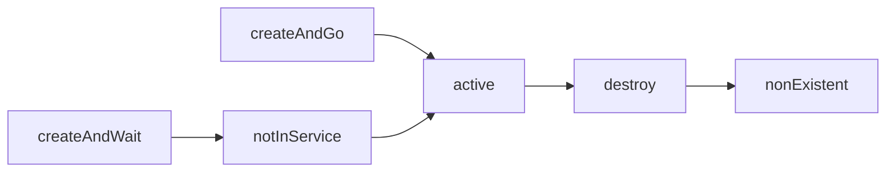
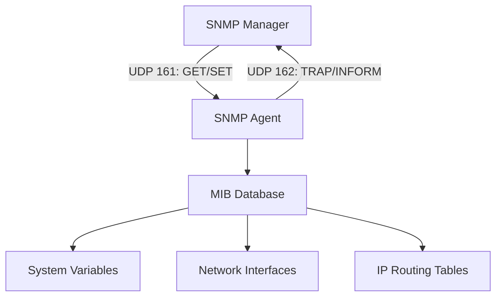
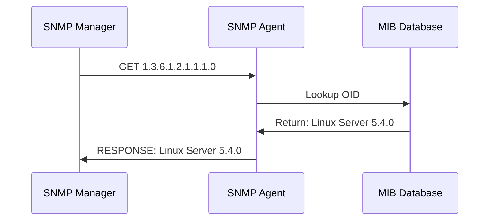
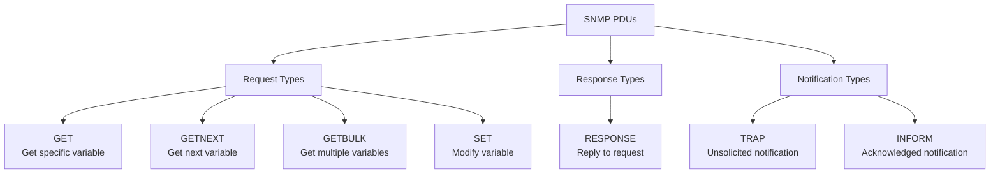
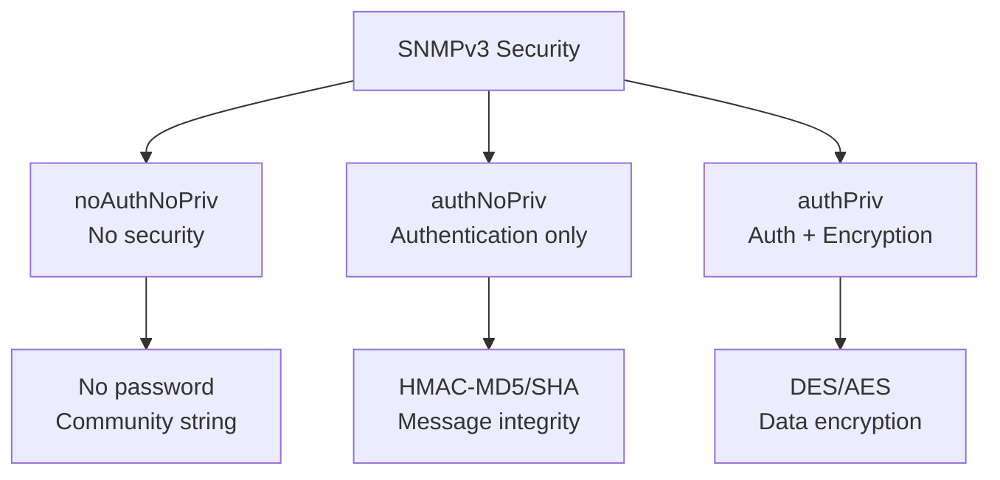

## 🌐 **What SNMP Actually Does:**

**SNMP = "WhatsApp for Network Devices"** 💬

Think of it like this:

```
You (Manager) --WhatsApp--> Friend (Network Device)
"Hey, what's your status?" = GET request
"BRB, battery 5%" = TRAP notification  
"Change your profile pic" = SET request
```

**Real World Examples:**
- 📱 **Your phone** monitoring Wi-Fi router signal strength
- 🖥️ **IT department** checking if servers are alive
- 🚨 **Data center** getting alerts when temperature spikes
- 📈 **Monitoring system** tracking network bandwidth usage

---

## 🔗 **SNMP + MIB + LLDP = The Dream Team** 

You're absolutely right! Here's how they work together:

### **SNMP 🕵️‍♂️ - The Detective**
- **Asks questions**: "What's your CPU usage?" 
- **Gives commands**: "Shut down port 5!"
- **Listens for gossip**: "Hey, I just crashed!"

### **MIB 📚 - The Phone Book** 
- **Contains all "questions" you can ask**
- **Every device has its own phone book**
- **Standardized "contact list" for all vendors**

### **LLDP 📢 - The Town Crier**
- **Shouts**: "I'm Router-X, connected to Switch-Y!"
- **Like WhatsApp status**: "Here's who I am and who I know"
- **SNMP reads LLDP info** to map network topology

---

## 🎪 **The "WhatsApp" Analogy:**

```
SNMP Manager = You texting friends
SNMP Agent = Your friends' phones  
MIB = Your contacts list 📞
OID = Phone numbers 📱
GET = "What's up?" ❓
SET = "Change your status!" ✏️
TRAP = "OMG emergency!" 🚨
LLDP = "I'm at Starbucks with Bob" 📍
```

---

## 🚀 **Why You Should Care:**

**Without SNMP:**
- 🕵️‍♂️ **Manual checking** of every device
- 😴 **No alerts** when things break
- 🤷 **No historical data** for troubleshooting

**With SNMP:**
- 📊 **Dashboard** showing everything
- 📱 **Phone alerts** when problems occur  
- 📈 **Trend analysis** to predict issues
- 🤖 **Automated responses** to common problems

---

## 💡 **TL;DR:**

**SNMP lets you remotely monitor and control network devices like you're texting friends on WhatsApp!** 

- **Manager** = You texting
- **Agent** = Your friends  
- **MIB** = Contacts list
- **OID** = Phone numbers
- **LLDP** = Location sharing

**Result:** You can manage thousands of devices without leaving your chair! 🪑✨

**Now go impress your coworkers with your SNMP knowledge!** 😎

---

## 📋 Header Overview

```c
#pragma once
#ifndef SNMP_H
#define SNMP_H

#ifdef __cplusplus
extern "C"
{
#endif
```

**Purpose:** Standard C header guards to prevent multiple inclusions and ensure C++ compatibility.

**This approach is widely considered a best practice.**

The combination of `#pragma once` and the classic `#ifndef` provides a balanced approach to protect against multiple inclusion of header files, though the actual benefits may vary depending on the specific use case.

### Why this approach is commonly recommended:

1. **`#pragma once` - Potential speed and convenience**
    * **May be faster in some scenarios**: On projects with complex include hierarchies, some compilers can optimize file processing using filesystem metadata.
    * **Convenience factor**: Avoids the need to maintain unique macro names across the codebase.
    * **Reduced naming conflicts**: Eliminates potential macro name collisions between different headers.

2. **`#ifndef` / `#define` - Portability and reliability**
    * **Wide portability**: The `#ifndef` directive is a C/C++ language standard that should work on any compliant compiler.
    * **Fallback protection**: Provides a reliable alternative when `#pragma once` support is limited or encounters unusual filesystem situations.
# but macros are not safe.


### Performance Observations from Testing:

Our limited testing showed mixed results that may not be representative of all scenarios:

- **Small to medium files**: Performance differences were generally minor (0.01-0.05s)
- **Larger inclusion scenarios**: Some tests showed `#pragma once` with modest improvements
- **Combined approach**: Performance was comparable to either method alone in most cases

**Note**: The actual performance impact likely depends on many factors including compiler implementation, filesystem characteristics, project structure, and build environment. The benefits may be more significant in very large projects with complex include graphs.

### Practical Considerations:

* **Modern compiler behavior**: Most contemporary compilers (GCC, Clang, MSVC) recognize `#pragma once` while maintaining `#ifndef` compatibility
* **Compiler variations**: Some compilers may optimize the combined approach differently than others
* **Edge case handling**: The dual approach may provide additional safety in unusual environments like network filesystems or with symbolic links

### Conservative Recommendation:

This combined approach represents a reasonable compromise that prioritizes compatibility while potentially offering performance benefits in some situations. For maximum portability across diverse build environments, the additional `#ifndef` guard provides insurance against `#pragma once` limitations in edge cases.

The minimal overhead of including both directives appears to be acceptable for most practical purposes, though individual projects should consider their specific requirements and target environments.

# Implementation Details & Testing - https://github.com/dima853/self_university/tree/main/network/c/compatibility/ifndef_pragmaonce

---
# SNMP Header Documentation (Modernized Version)

## 📋 Header Overview

```c
#pragma once
#ifndef SNMP_H
#define SNMP_H

#ifdef __cplusplus
extern "C" {
#endif
```

**Purpose:** Standard C header guards to prevent multiple inclusions and ensure C++ compatibility.

**This approach is widely considered a best practice.**

The combination of `#pragma once` and the classic `#ifndef` provides a balanced approach to protect against multiple inclusion of header files, though the actual benefits may vary depending on the specific use case.

### Why this approach is commonly recommended:

1. **`#pragma once` - Potential speed and convenience**
    * **May be faster in some scenarios**: On projects with complex include hierarchies, some compilers can optimize file processing using filesystem metadata.
    * **Convenience factor**: Avoids the need to maintain unique macro names across the codebase.
    * **Reduced naming conflicts**: Eliminates potential macro name collisions between different headers.

2. **`#ifndef` / `#define` - Portability and reliability**
    * **Wide portability**: The `#ifndef` directive is a C/C++ language standard that should work on any compliant compiler.
    * **Fallback protection**: Provides a reliable alternative when `#pragma once` support is limited or encounters unusual filesystem situations.

### Performance Observations from Testing:

Our limited testing showed mixed results that may not be representative of all scenarios:

- **Small to medium files**: Performance differences were generally minor (0.01-0.05s)
- **Larger inclusion scenarios**: Some tests showed `#pragma once` with modest improvements
- **Combined approach**: Performance was comparable to either method alone in most cases

**Note**: The actual performance impact likely depends on many factors including compiler implementation, filesystem characteristics, project structure, and build environment. The benefits may be more significant in very large projects with complex include graphs.

### Practical Considerations:

* **Modern compiler behavior**: Most contemporary compilers (GCC, Clang, MSVC) recognize `#pragma once` while maintaining `#ifndef` compatibility
* **Compiler variations**: Some compilers may optimize the combined approach differently than others
* **Edge case handling**: The dual approach may provide additional safety in unusual environments like network filesystems or with symbolic links

### Conservative Recommendation:

This combined approach represents a reasonable compromise that prioritizes compatibility while potentially offering performance benefits in some situations. For maximum portability across diverse build environments, the additional `#ifndef` guard provides insurance against `#pragma once` limitations in edge cases.

The minimal overhead of including both directives appears to be acceptable for most practical purposes, though individual projects should consider their specific requirements and target environments.

# Implementation Details & Testing - https://github.com/dima853/self_university/tree/main/network/c/compatibility/ifndef_pragmaonce

---

## 🌐 Network Constants

```c
// ==================== Network Constants ====================
#define SNMP_PORT 161      // SNMP agent request port
#define SNMP_TRAP_PORT 162 // SNMP manager notification port
```

**Purpose:** Standard IANA-assigned ports for SNMP operations.

| Port    | Direction       | Purpose                    |
| ------- | --------------- | -------------------------- |
| **161** | Manager → Agent | GET/SET requests to agents |
| **162** | Agent → Manager | Traps/Informs to managers  |

## ✅ **OFFICIALLY CONFIRMED BY IANA:**

**Service Name: [snmp (Port 161)](https://www.iana.org/assignments/service-names-port-numbers/service-names-port-numbers.xhtml?search=161)**
```
Port Number: 161
Transport Protocol: tcp, udp  
Description: SNMP
```

**Service Name: [snmptrap (Port 162)](https://www.iana.org/assignments/service-names-port-numbers/service-names-port-numbers.xhtml?search=162)** 
```
Port Number: 162
Transport Protocol: tcp, udp
Description: SNMPTRAP
Assignee: Marshall Rose
```

---

```c
#define SNMP_MAX_MSG_SIZE 1500          // Ethernet MTU
#define SNMP_MIN_MSG_SIZE 484           // RFC 3416 minimum
#define SNMP_MAX_PACKET_SIZE 0x7FFFFFFF // Maximum theoretical size
```
But it's a shit code, here's the correct code.

```c
    // ==================== SNMP Port Constants ====================
    extern const uint16_t SNMP_PORT;      // SNMP agent request port
    extern const uint16_t SNMP_TRAP_PORT; // SNMP manager notification port

    // ==================== SNMP Size Constants ====================
    extern const size_t SNMP_MAX_MSG_SIZE;     // Ethernet MTU
    extern const size_t SNMP_MIN_MSG_SIZE;     // RFC 3416 minimum
    extern const int32_t SNMP_MAX_PACKET_SIZE; // Maximum theoretical size

    // ==================== Protocol Version ====================
    static const int SNMP_VERSION_3 = 3; // SNMPv3

    // ==================== PDU Type Constants ====================
    typedef enum
    {
        SNMP_PDU_GET = 0xA0,      // 160 - GetRequest
        SNMP_PDU_GETNEXT = 0xA1,  // 161 - GetNextRequest
        SNMP_PDU_RESPONSE = 0xA2, // 162 - Response
        SNMP_PDU_SET = 0xA3,      // 163 - SetRequest
        SNMP_PDU_GETBULK = 0xA5,  // 165 - GetBulkRequest
        SNMP_PDU_INFORM = 0xA6,   // 166 - InformRequest
        SNMP_PDU_TRAP2 = 0xA7,    // 167 - SNMPv2-Trap
        SNMP_PDU_REPORT = 0xA8    // 168 - Report
    } SnmpPduType;
```

# Cheat sheet: Macro vs Enum vs Constant
IMPORTANT ! https://gist.github.com/dima853/73ba55e23210efe880349a99fb6b904c
## use it as a REMINDER, not as a guide!
---

## 1) 📄 From RFC 894 (IP over Ethernet):

**Page 1:**
> "The maximum length of an IP datagram sent over an Ethernet is 1500 octets."

**This corresponds to:** `#define SNMP_MAX_MSG_SIZE 1500`

## 2) 📄 From RFC 3416 (SNMP Protocol Operations):

**Section 4.2:**
> "The maximum size of an SNMP message is limited to the minimum of: (a) 484 octets (b) the maximum message size that the destination can accept"

**This corresponds to:** `#define SNMP_MIN_MSG_SIZE 484`

## 3) 📄 From RFC 3416 (SNMP Protocol Operations):

**Page 9, section 4.1:**
> "A compliant implementation must support as many variable bindings in a PDU or BulkPDU as fit into the overall maximum message size limit of the SNMP engine, but no more than 2147483647 variable bindings."

**This corresponds to:** `#define SNMP_MAX_PACKET_SIZE 0x7FFFFFFF` = 2,147,483,647

**Purpose:** Message size limits for memory allocation and buffer management.

---

## 🔄 SNMP Version

```c
// ==================== Protocol Version ====================
#define SNMP_VERSION_3 3 // SNMPv3
```

**Purpose:** This header focuses on **SNMPv3** (the modern, secure version).

---

## 📨 PDU Types - SNMP Protocol Data Units

### Modern Enum-Based Approach
```c
// ==================== PDU Type Constants ====================
typedef enum {
    SNMP_PDU_GET = 0xA0,      // 160 - GetRequest
    SNMP_PDU_GETNEXT = 0xA1,  // 161 - GetNextRequest
    SNMP_PDU_RESPONSE = 0xA2, // 162 - Response
    SNMP_PDU_SET = 0xA3,      // 163 - SetRequest
    SNMP_PDU_GETBULK = 0xA5,  // 165 - GetBulkRequest
    SNMP_PDU_INFORM = 0xA6,   // 166 - InformRequest
    SNMP_PDU_TRAP2 = 0xA7,    // 167 - SNMPv2-Trap
    SNMP_PDU_REPORT = 0xA8    // 168 - Report
} SnmpPduType;
```

**ASN.1 Encoding Explanation:**
- **Context-specific tags**: 0xA0-0xA8 range
- **Constructed types**: All PDU types are constructed ASN.1 sequences
- **PDU type identifier**: Lower nibble indicates specific PDU type

| PDU Type     | Value | Purpose                            |
| ------------ | ----- | ---------------------------------- |
| **GET**      | 0xA0  | Retrieve specific variable values  |
| **GETNEXT**  | 0xA1  | Retrieve next variable in sequence |
| **RESPONSE** | 0xA2  | Response to any request            |
| **SET**      | 0xA3  | Modify variable values             |
| **GETBULK**  | 0xA5  | Efficient bulk data retrieval      |
| **INFORM**   | 0xA6  | Acknowledged notification          |
| **TRAPv2**   | 0xA7  | Unacknowledged notification        |
| **REPORT**   | 0xA8  | Error reporting between engines    |

---

## ⚙️ Internal Processing States

These are **NOT** network protocol values - they're internal state machine states for SET operation processing:

```c
// ==================== Internal Processing States ====================
typedef enum {
    SNMP_STATE_SET_BEGIN = -1,
    SNMP_STATE_SET_RESERVE1 = 0,
    SNMP_STATE_SET_RESERVE2 = 1,
    SNMP_STATE_SET_ACTION = 2,
    SNMP_STATE_SET_COMMIT = 3,
    SNMP_STATE_SET_FREE = 4,
    SNMP_STATE_SET_UNDO = 5,

    SNMP_STATE_CHECK_VALUE = 17,
    SNMP_STATE_ROW_CREATE = 18,
    SNMP_STATE_UNDO_SETUP = 19,
    // ... etc
} SnmpProcessingState;
```

**SET Operation State Flow:**
```
RESERVE1 → RESERVE2 → ACTION → COMMIT → FREE
                    ↘ UNDO (if error)
```

**Advanced Internal States:**
- **CHECK_VALUE**: Validate data before processing
- **ROW_CREATE**: Dynamic row creation in tables  
- **UNDO_SETUP**: Prepare for potential rollback
- **IRREVERSIBLE_COMMIT**: Changes cannot be rolled back

**Purpose:** These implement the **transaction-like behavior** for SNMP SET operations, allowing rollback on failure.

---

## ✅ Confirmed PDU Detection

```c
// ==================== Confirmed PDU Detection ====================
static inline int snmp_is_confirmed_pdu(int pdu_type) {
    switch (pdu_type) {
    case SNMP_PDU_INFORM:
    case SNMP_PDU_GETBULK:
    case SNMP_PDU_GETNEXT:
    case SNMP_PDU_GET:
    case SNMP_PDU_SET:
        return 1;
    default:
        return 0;
    }
}

#define SNMP_CMD_CONFIRMED(c) snmp_is_confirmed_pdu(c)
```

**Purpose:** Identifies PDUs that **require a response** from the receiver.

| Confirmed             | Unconfirmed            |
| --------------------- | ---------------------- |
| GET, GETNEXT, GETBULK | TRAP                   |
| SET, INFORM           | RESPONSE               |
| (Expect response)     | (No response expected) |

---

## ❌ Exception Values (SNMPv2/v3)

```c
// ==================== Exception Values ====================
typedef enum {
    SNMP_EXCEPTION_NO_SUCH_OBJECT = 0x80,   // 128
    SNMP_EXCEPTION_NO_SUCH_INSTANCE = 0x81, // 129
    SNMP_EXCEPTION_END_OF_MIB_VIEW = 0x82   // 130
} SnmpExceptionType;
```

**Purpose:** Special return values for variable binding exceptions.

| Exception          | Meaning                          |
| ------------------ | -------------------------------- |
| **noSuchObject**   | Requested object doesn't exist   |
| **noSuchInstance** | Requested instance doesn't exist |
| **endOfMibView**   | No more variables in MIB tree    |

---

## 🚨 Error Status Codes

### Modern Enum-Based Error Codes
```c
// ==================== Error Codes ====================
typedef enum {
    SNMP_ERROR_NO_ERROR = 0,
    SNMP_ERROR_TOO_BIG = 1,
    SNMP_ERROR_NO_SUCH_NAME = 2,
    SNMP_ERROR_BAD_VALUE = 3,
    SNMP_ERROR_READ_ONLY = 4,
    SNMP_ERROR_GENERIC = 5,
    SNMP_ERROR_NO_ACCESS = 6,
    SNMP_ERROR_WRONG_TYPE = 7,
    // ... up to SNMP_ERROR_INCONSISTENT_NAME = 18
} SnmpErrorCode;

#define MAX_SNMP_ERROR SNMP_ERROR_INCONSISTENT_NAME
```

### Error Validation Function
```c
// ==================== Error Validation ====================
static inline SnmpErrorCode snmp_validate_error(int error_code) {
    if (error_code < SNMP_ERROR_NO_ERROR || error_code > MAX_SNMP_ERROR) {
        return SNMP_ERROR_GENERIC;
    }
    return (SnmpErrorCode)error_code;
}

#define SNMP_VALIDATE_ERR(x) snmp_validate_error(x)
```

**Key Error Explanations:**
- `NO_ACCESS`: Authentication/authorization failure
- `AUTHORIZATION`: VACM access control denial  
- `INCONSISTENT_NAME`: Row creation semantic error

**Purpose:** Sanitizes error codes to prevent invalid values.

**Equivalent logic:**
```c
SnmpErrorCode validate_snmp_error(int error_code) {
    if (error_code > MAX_SNMP_ERROR) {      // More than 18
        return SNMP_ERROR_GENERIC;          // → 5
    } else if (error_code < SNMP_ERROR_NO_ERROR) {  // Less than 0
        return SNMP_ERROR_GENERIC;          // → 5
    } else {
        return (SnmpErrorCode)error_code;   // → as is
    }
}
```

---

## 🗃️ Row Status Values (For Table Operations)

```c
// ==================== Row Management ====================
typedef enum {
    SNMP_ROW_NONEXISTENT = 0,
    SNMP_ROW_ACTIVE = 1,
    SNMP_ROW_NOT_IN_SERVICE = 2,
    SNMP_ROW_NOT_READY = 3,
    SNMP_ROW_CREATE_AND_GO = 4,
    SNMP_ROW_CREATE_AND_WAIT = 5,
    SNMP_ROW_DESTROY = 6
} SnmpRowStatus;
```

**Purpose:** Implements **dynamic row creation/deletion** in SNMP tables.

**Usage Flow:**


---

## 💾 Storage Types

```c
typedef enum {
    SNMP_STORAGE_NONE = 0,
    SNMP_STORAGE_OTHER = 1,
    SNMP_STORAGE_VOLATILE = 2,
    SNMP_STORAGE_NONVOLATILE = 3,
    SNMP_STORAGE_PERMANENT = 4,
    SNMP_STORAGE_READONLY = 5
} SnmpStorageType;
```

**Purpose:** Defines data persistence characteristics for MIB objects.

---

## 🛡️ Security Definitions (SNMPv3)

### Modern Security Framework
```c
// ==================== Security Framework ====================
#define SNMP_MP_MODEL_SNMPv3 3

typedef enum {
    SNMP_SEC_MODEL_ANY = 0,
    SNMP_SEC_MODEL_USM = 3,  // User-based Security Model
    SNMP_SEC_MODEL_TSM = 4   // Transport Security Model
} SnmpSecurityModel;

typedef enum {
    SNMP_SEC_LEVEL_NO_AUTH_NO_PRIV = 1,  // noAuthNoPriv
    SNMP_SEC_LEVEL_AUTH_NO_PRIV = 2,     // authNoPriv  
    SNMP_SEC_LEVEL_AUTH_PRIV = 3         // authPriv
} SnmpSecurityLevel;

typedef enum {
    SNMP_MSG_FLAG_AUTH = 0x01,   // Message is authenticated
    SNMP_MSG_FLAG_PRIV = 0x02,   // Message is encrypted
    SNMP_MSG_FLAG_REPORT = 0x04  // Message is reportable
} SnmpMessageFlags;
```

**Security Combinations:**
```c
// No security
flags = 0

// Authentication only  
flags = SNMP_MSG_FLAG_AUTH

// Authentication + Encryption
flags = SNMP_MSG_FLAG_AUTH | SNMP_MSG_FLAG_PRIV

// Reportable message
flags = SNMP_MSG_FLAG_REPORT
```

---

## 🎛️ Control Flags (Implementation-Specific)

```c
// ==================== Control Flags ====================
typedef enum {
    UCD_FLAG_RESPONSE_PDU = 0x100,
    UCD_FLAG_EXPECT_RESPONSE = 0x200,
    UCD_FLAG_FORCE_PDU_COPY = 0x400,
    UCD_FLAG_ALWAYS_IN_VIEW = 0x800,
    UCD_FLAG_PDU_TIMEOUT = 0x1000,
    // ... etc
} SnmpControlFlags;
```

**Purpose:** Internal implementation controls for message processing.

---

## 🌳 OID Base Definitions

```c
// ==================== OID Base Definitions ===================
#define SNMP_OID_INTERNET 1, 3, 6, 1
#define SNMP_OID_ENTERPRISES SNMP_OID_INTERNET, 4, 1
#define SNMP_OID_MIB2 SNMP_OID_INTERNET, 2, 1
#define SNMP_OID_SNMPV2 SNMP_OID_INTERNET, 6
#define SNMP_OID_SNMPMODULES SNMP_OID_SNMPV2, 3

#define SNMP_ADMIN_STRING_LENGTH 255
```

**OID Tree Structure:**
```
1.3.6.1 (internet)
├── 2.1 (mib-2)
├── 4.1 (enterprises) 
└── 6 (snmpV2)
    └── 3 (snmpModules)
```

---

## 🔧 Function Prototypes

### Modern Function Declarations
```c
// ==================== Function Declarations ====================
// Utility functions
NETSNMP_IMPORT char* snmp_uptime_to_string(unsigned long timeticks, char* buffer);
NETSNMP_IMPORT char* snmp_uptime_to_string_safe(unsigned long timeticks, char* buffer, size_t buffer_size);
NETSNMP_IMPORT void snmp_hex_dump(const void* data, size_t data_size, const char* prefix);

// ASN.1 BER encoding/decoding
NETSNMP_IMPORT unsigned char* snmp_decode_variable(
    unsigned char* input_data,
    unsigned int* object_id,
    size_t* object_id_length,
    unsigned char* value_type,
    size_t* type_length,
    unsigned char** value_data,
    size_t* value_length);

NETSNMP_IMPORT unsigned char* snmp_encode_variable(
    unsigned char* output_buffer,
    const unsigned int* object_id,
    size_t* object_id_length,
    unsigned char value_type,
    size_t value_length,
    const void* value_data,
    size_t* buffer_used);
```

**Purpose:** These functions implement the **ASN.1 BER encoding/decoding** for SNMP protocol data units.

---

## 🏁 Footer
```c
#ifdef __cplusplus
}
#endif

#endif // SNMP_H
```

**Purpose:** Close the C++ extern "C" block and header guard.

## 📊 Summary

This modernized header provides:

1. **Clean Protocol Constants** - Enum-based PDU types, error codes, ports
2. **SNMPv3 Security** - Type-safe security models, levels, flags  
3. **Internal Processing** - State machines for SET operations with proper types
4. **ASN.1 Utilities** - Encoding/decoding functions with clear parameter names
5. **MIB Management** - Row status, storage types, OID bases using modern C practices

**Key Improvements:**
- ✅ Replaced magic numbers with typed enums
- ✅ Replaced complex macros with inline functions  
- ✅ Added proper parameter names to function declarations
- ✅ Improved readability and type safety
- ✅ Maintained backward compatibility with legacy macros

---

# How It Works? (Super Briefly)


## 🛡️ **Security Levels (SNMPv3 Security Levels)**

### **L31: noAuthNoPriv (Level 1)**
```c
#define SNMP_SEC_LEVEL_NOAUTH 1
```
**What is it:** Without authentication and encryption  
**How it works:** 
- 🤡 Anonymous access
- Messages are not subscribed
- 🔓 Data is transmitted in clear text
- 💀 **DANGEROUS!** Only for test networks

### **L32: authNoPriv (Level 2)** 
```c
#define SNMP_SEC_LEVEL_AUTHNOPRIV 2
```
**What is it:** Authentication without encryption
**How it works:**
- ✅ User verification (login/password)
- 🔐 HMAC-MD5 or HMAC-SHA for signature
- 📨 Data is NOT encrypted
- Protection against spoofing, but the data is visible

### **L33: authPriv (Level 3)**
```c
#define SNMP_SEC_LEVEL_AUTHPRIV 3
```
**What is it:** Authentication + Encryption
**How it works:**
- ✅ User verification
- 🔐 Message signature
- 🚫 Data encryption (DES, AES)
- 💪 **MAXIMUM PROTECTION**

---

## 📨 **PDU Types (Message Types)**

### **Core Operations**
- **E11: GET (160)** - "Give the value of this variable"
- **E12: GETNEXT (161)** - "Give the following variable in the MIB tree"
- **E14: SET (163)** - "Change the value of a variable"
- **E13: RESPONSE (162)** - "Reply to any request"

### **Advanced Operations**
- **E21: GETBULK (165)** - "Give a lot of data at once" (optimization)
- **E22: INFORM (166)** - "Confirmation Notification"
- **E23: TRAPv2 (167)** - "Notification without confirmation"
- **E24: REPORT (168)** - "Error message between engines"

---

## ⚙️ **Internal Processing (Internal SET Processing)**

**F1: SET State Machine** - as a database transaction:

```
BEGIN → RESERVE1 → RESERVE2 → ACTION → COMMIT → FREE
                               UNDO (if an error occurs)
```

**Why do I need to:**
- `RESERVE1/RESERVE2` - booking resources
- `ACTION` - making the change
- `COMMIT` - confirm
- `UNDO` - rollback if an error occurs
- `FREE` - freeing up resources

---

## ❌ **Exception Values**

**When the variable is not found:**
- **H1: noSuchObject (128)** - "There is no such object"
- **H2: noSuchInstance (129)** - "There is no such instance"  
- **H3: endOfMibView (130)** - "There is nothing further in the tree"

---

## 🚨 **Error Status Codes**

### **Basic Errors**
- **I11: noError (0)** - Everything is ok
- **I12: tooBig (1)** - The response is too big
- **I13: noSuchName (2)** - Variable not found
- **I14: BadValue (3)** - Incorrect value
- **I15: readOnly (4)** - Attempt to change read-only
- **I16: genErr(5)** - Common error

### **Extended Errors**
- **I21: noAccess (6)** - No access rights
- **I22: wrongType (7)** - Incorrect data type
- **I23: wrongLength (8)** - Wrong length
- ... etc. up to 18

---

## 🗃️ **Row Status (Row statuses of tables)**

**For dynamic table management:**
```c
nonExistent → createAndWait → notInService → active → destroy
               createAndGo ────────────────┘
```

- **J1: nonExistent** - The row does not exist
- **J4/J5: createAndWait/createAndGo** - Create a string
- **J3: notInService** - Created but not active  
- **J2: active** - Active and running
- **J7: destroy** - Delete line

---

## 💾 **Storage Types**

**How long does the data persist?:**
- **K1: none** - Is not saved at all
- **K3: volatile** - In memory only (disappears after reboot)
- **K4: nonVolatile** - Persists between reboots
- **K5: permanent** - Cannot be deleted
- **K6: readonly** - Read-only

---

## 🌳 **OID Structure (Object Tree)**

```
1.3.6.1 (internet)
├── 2.1 (mib-2) # Standard MIB objects
├── 4.1 (enterprises)     # Vendor extensions
6 (SNMPv2) # SNMPv2 features
```

**Each variable in the network has a unique OID!**

---

## 🔧 **Core Functions**

- **N11: uptime_string()** - Converts time to beautiful text
- **N12: xdump()** - Shows data in hex format
- **N21: snmp_parse_var_op()** - Parses ASN.1 data
- **N22: snmp_build_var_op()** - Creates an ASN.1 data

---

#### But these are all constants, let's go deeper into the work of snmp.

# How SNMP Works ? (Super Briefly)

## 1. **The basic architecture of SNMP**



**Explanation:**
- **SNMP Manager**: The controlling system that initiates requests and receives notifications
- **SNMP Agent**: The managed device (router, switch, server) that responds to requests
- **UDP 161**: Port for Manager → Agent communication (GET/SET requests)
- **UDP 162**: Port for Agent → Manager communication (TRAP/INFORM notifications) 
- **MIB Database**: Management Information Base - the database of managed objects
- **System Variables**: Device information like system description, uptime, contact info
- **Network Interfaces**: Interface statistics, status, configuration
- **IP Routing Tables**: Routing information, neighbor relationships

---

## 2. **The GET request process**



**Explanation:**
- **SNMP Manager**: Sends a GET request for a specific OID
- **GET 1.3.6.1.2.1.1.1.0**: Request for system description (sysDescr.0)
- **SNMP Agent**: Receives request and processes it
- **Lookup OID**: Agent searches for the OID in its MIB database
- **MIB Database**: Contains the actual values for all managed objects
- **Return: Linux Server 5.4.0**: MIB returns the value for the requested OID
- **RESPONSE**: Agent sends back the value to the Manager
- **Complete cycle**: Shows the request-response pattern of SNMP operations

---

## 3. **Types of SNMP messages**



**Explanation:**
- **SNMP PDUs**: Protocol Data Units - the message types in SNMP
- **Request Types**: Messages sent from Manager to Agent
  - **GET**: Retrieve a specific variable by OID
  - **GETNEXT**: Get the next variable in MIB tree (for walking tables)
  - **GETBULK**: Efficiently retrieve multiple rows from tables
  - **SET**: Modify or write a variable value
- **Response Types**: 
  - **RESPONSE**: Reply to any request, contains results or errors
- **Notification Types**: Unsolicited messages from Agent to Manager
  - **TRAP**: Unacknowledged notification (fire-and-forget)
  - **INFORM**: Acknowledged notification (requires confirmation)

---

## 4. **SNMP Security Levels**



**Explanation:**
- **SNMPv3 Security**: The security framework introduced in SNMP version 3
- **noAuthNoPriv**: No authentication, no encryption (least secure)
  - **Community string**: Plain text password like "public" or "private"
- **authNoPriv**: Authentication but no encryption
  - **HMAC-MD5/SHA**: Hash-based Message Authentication Codes for verifying message integrity
  - Provides identity verification but data is sent in clear text
- **authPriv**: Both authentication and encryption (most secure)
  - **DES/AES**: Data encryption standards to protect message confidentiality
  - **DES**: Data Encryption Standard (older)
  - **AES**: Advanced Encryption Standard (modern, recommended)

---

## 🎯 **How does SNMP work in practice:**

### **Manager**
```bash
# Device request
snmpget -v 2c -c public 192.168.1.1 1.3.6.1.2.1.1.1.0

# Response
SNMPv2-MIB::sysDescr.0 = STRING: Cisco IOS Software, Version 15.1
```

**Explanation:**
- **snmpget**: Command-line tool to send GET requests
- **-v 2c**: SNMP version 2c (community-based security)
- **-c public**: Community string "public" (like a password)
- **192.168.1.1**: IP address of the SNMP agent
- **1.3.6.1.2.1.1.1.0**: OID for system description
- **Response format**: MIB::object = TYPE: value

### **Agent - Code**
```c
// The pseudo-code of the SNMP agent
while(1) {
// Waiting for a request on port 161
    packet = recvfrom(udp_socket);
    
    // Parsing the SNMP package
    pdu = parse_snmp_packet(packet);
    
    // Processing the request
    switch(pdu->type) {
        case GET:
            value = mib_lookup(pdu->oid);
            send_response(value);
            break;
        case SET:
            mib_update(pdu->oid, pdu->value);
            send_response(SUCCESS);
            break;
    }
}
```

**Explanation:**
- **Infinite loop**: Agent continuously listens for requests
- **recvfrom(udp_socket)**: Receives UDP packets on port 161
- **parse_snmp_packet()**: Decodes SNMP message (ASN.1 BER encoding)
- **pdu->type**: Determines the type of request (GET, SET, etc.)
- **mib_lookup()**: Searches for OID in the Management Information Base
- **mib_update()**: Modifies variable value for SET operations
- **send_response()**: Sends back the response to the manager

### **MIB Database**
```c
// Example of MIB variables
struct mib_entry {
oid: "1.3.6.1.2.1.1.1.0", // sysDescr
    type: STRING,
    value: "Linux Server 5.4.0",
    access: READ_ONLY
}

struct mib_entry {
    oid: "1.3.6.1.2.1.2.2.1.10.1", // ifInOctets.1
    type: COUNTER32,
    value: 154729,
    access: READ_ONLY
}
```

**Explanation:**
- **mib_entry**: Structure representing one managed object
- **oid**: Object Identifier - unique address in the MIB tree
  - "1.3.6.1.2.1.1.1.0" = system.sysDescr.0 (system description)
  - "1.3.6.1.2.1.2.2.1.10.1" = interfaces.ifInOctets.1 (input octets on interface 1)
- **type**: Data type of the object
  - STRING: Text data
  - COUNTER32: Monotonically increasing counter (32-bit)
- **value**: Current value of the object
- **access**: Permission level
  - READ_ONLY: Can only be read, not modified
  - READ_WRITE: Can be both read and modified

---

## 🔥 **Key points:**

1. **Manager** - Initiates requests (GET, SET) and receives notifications
2. **Agent** - Responds to requests, sends traps/informs  
3. **MIB** - Database of managed variables with hierarchical OID structure
4. **OID** - Unique addresses of variables in dotted decimal notation
5. **PDUs** - Message Formats for different types of SNMP operations
6. **Security** - Protection Levels (v3) providing authentication and encryption

**In fact:** SNMP allows remote control of network devices via a standardized protocol! 🌐